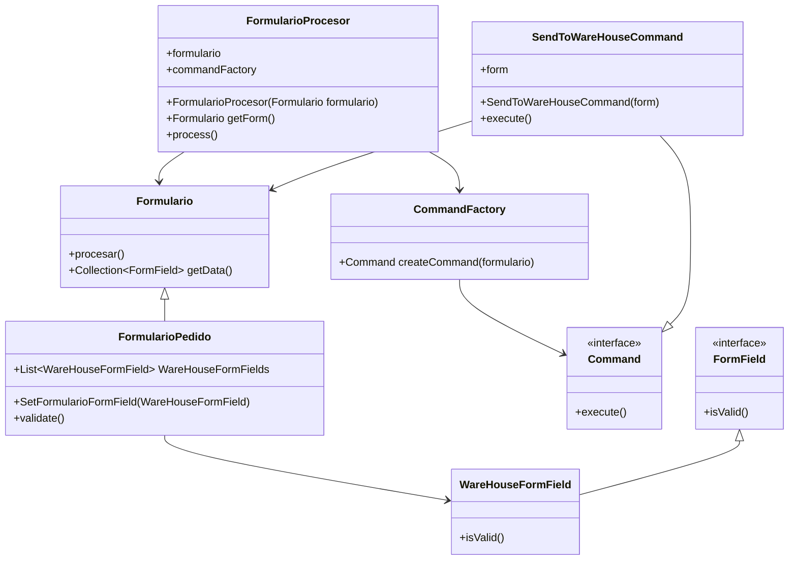

# Apartado 1


# Apartado 
```mermaid
sequenceDiagram
    App ->> FormularioPedido : new()
    FormularioPedido -->> App : formularioPedido
    
    App->>FormularioProcessor: new FormularioProcesor(Formulario formularioPedido)
    FormularioProcessor --> CommandFactory:new()
    CommandFactory -->> FormularioProcessor : commandFactory
    FormularioProcessor -->> App: formularioProcessor
    App ->> FormularioProcessor: process()
    FormularioProcessor ->> CommandFactory: CreateCommand(form)
    CommandFactory ->> SendToWareHouseCommand : new SendToWareHouseCommand(form)
    SendToWareHouseCommand -->> CommandFactory : SendToWareHouseCommand command
    CommandFactory -->> FormularioProcessor: Command command
    FormularioProcessor ->> SendToWareHouseCommand : execute()
    SendToWareHouseCommand ->> FormularioPedido : getData()
    FormularioPedido -->> SendToWareHouseCommand : formField
   ```
