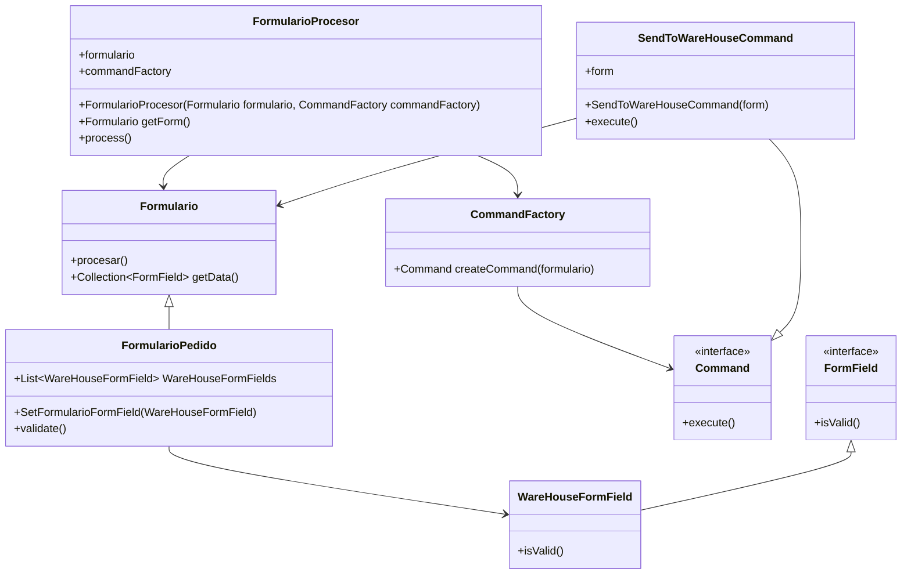

# Apartado 1

```mermaid
classDiagram

class Formulario
    Formulario: +procesar()
    Formulario: +Collection~FormField~ getData()

class FormularioProcesor
    FormularioProcesor: +FormularioProcesor(Formulario formulario, CommandFactory commandFactory)
    FormularioProcesor: +formulario
    FormularioProcesor: +commandFactory
    FormularioProcesor: +Formulario getForm()
    FormularioProcesor: +process()

class FormularioPedido
    FormularioPedido: +SetFormularioFormField(WareHouseFormField)
    FormularioPedido: +List~WareHouseFormField~ WareHouseFormFields
    FormularioPedido: +validate()

class Command
    <<interface>> Command
    Command : +execute()

class SendToWareHouseCommand
    SendToWareHouseCommand : +form
    SendToWareHouseCommand: +SendToWareHouseCommand(form)
    SendToWareHouseCommand: +execute()
class FormField
    <<interface>> FormField
    FormField: +isValid()

class WareHouseFormField
    WareHouseFormField: +isValid()


class CommandFactory
    CommandFactory: +Command createCommand(formulario)

FormularioPedido --> WareHouseFormField
FormularioProcesor --> CommandFactory
FormularioProcesor --> Formulario
CommandFactory --> Command
SendToWareHouseCommand --|>Command
SendToWareHouseCommand --> Formulario
FormField <|-- WareHouseFormField
Formulario <|-- FormularioPedido
```
